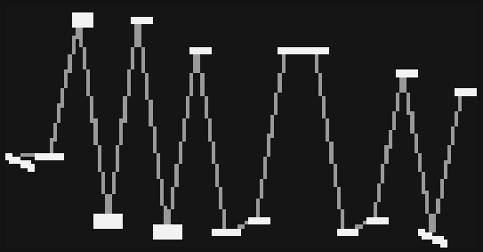

# acid test

generative acid basslines.


lately I've been listening to acid music and thinking about markov chains. previously I used markov chains to make a [jazz piano accompaniment](https://github.com/schollz/pianoai). it seemed to me that acid house basslines amenable to applying stateless logic for generating believable sequences. whether this is believable acid music or not is...debatable.

this script started off as a literal "test" to do A/B testing on different meta-parameters of the markov chains for exploring the parameter space.

## Requirements

- norns
- midi (optional)
- crow (optional)

## Documentation

### quick start



simply use K2/K3 to generate/modify sequences.

- K2 modifies current sequence
- K3 generates new sequence

you can have sequences modify themselves and evolve in a completely generative way by modifying `PARAMS > sequences > evolve`.

each time you generate/modify a sequence, it creates a saved sequence which you can recall.

- K1+E1 selects saved sequence
- K1+K3 loads saved sequence

### not-quick start

sequences are generated based on the transition probabilities in the markov chains. you can edit this properties to create your own style of generative acid basslines.

to enter the markov-chain editing mode hit K1+K2

- K1+K2 toggles markov chain editing mode
- E1 selects markov chain
- E2 selects transition
- E3 changes transition probability


the 16-note sequences based on 9 markov chains. the notes generated will either play in the build-in 303-style engine or can be output to the midi synth of your choice.

this script assumes you have some basic understanding for a markov chain! you can get a lot of info and examples about markov chains [here](https://en.wikipedia.org/wiki/Markov_chain#Examples). feel free to ask questions.

each step in a sequence has similar properties to the 303 sequencer in that it has three parameters: a note, a slide toggle, and an accent togger. each step in the sequence has these three parameters determined based on the state of a markov chain. the transitions between the states of the markov chain are under your control. use E1 to select an markov chain property and use E2 to select a transition in that property. then use E3 to modifty the probability of that transition. **the brighter the transition arrow, the higher the probability**. 

the combination of these 9 properties are then combined to generate the sequence.

### accent

transitions between "no" and "yes". when the state is 'yes', then the velocity will be increased slightly for that note.


### slide

transitions between "no" and "yes". when the state is 'yes', the portamento will be increased. for midi devices you can set the portamento cc in the `PARAMS > midi` section. for crow/engine output, the portamento is applied automatically.


### bass or lead

in designing this sequencer I felt that I had to distinguish between "bass" and "lead" notes in the bassline - "bass" notes typically being an octave below. I felt that acid basslines get part of the signature sound by oscillating between two intertwined melodies that are stacked vertically. so there are separate markov chains for the "bass" and "lead", which are combined using this "bass or lead" property.

this property transitions between "bass" and "lead". the generator actually generates 32 notes - 16 bass notes and 16 lead notes, but will only select either based on the state of this property.


### bass / lead coef+mult


the bass and lead parts each use two properties to generate a single note. the starting note of each sequence is the "base note" defined in the parameters. the base noteis then increased by `coef x mult` at each step in the sequence where `coef` and `mult` are determined by the current state in both of those markov chains. for example, if the `coef` state is `2` and the `mult` is `-1` then the sequence will transition `-2` notes in the scale.


the lead coef+mult works the same way as the bass coef+mult, but only affects the lead notes.


### bass / lead note

the legato of the note will be determined by the "bass note"  property (for bass notes) or the "lead note" property (for lead notes). if the state is "rest" then no note will be played, and any current note will be stopped. if the state is "new" then the current note will be stopped and a new note will be played. if the state is "hold" and the new note is the same as the last note, then there will be no gate, it will simply continue the note. if the new note is not the same and there is a slide, then portamento will be applied.


## Install

install using with

```
;install https://github.com/schollz/acid-test
```

